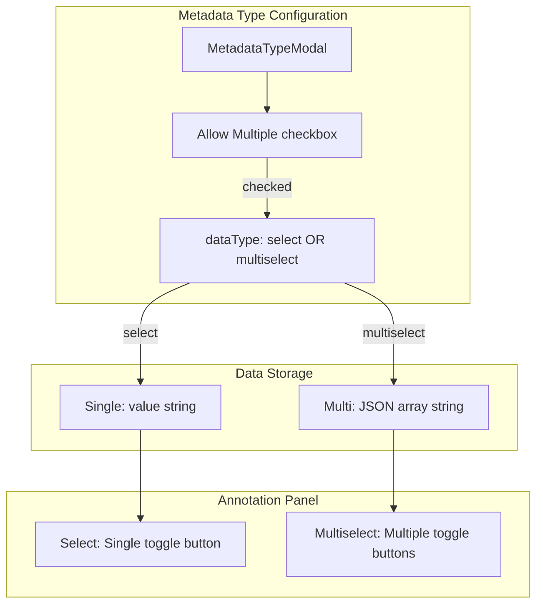

# Multi-Select Dropdown Implementation

Enable metadata fields to allow multiple value selection via a checkbox
toggle when creating/editing select-type fields.

## Architecture

## Key Files to Modify

| File | Purpose |
|------|---------|
| src/components/MetadataTypeModal.tsx | Add "Allow Multiple Selections" checkbox |
| src/components/MultiSelectToggle.tsx | New reusable toggle-button component |
| src/components/ImageMetadataPanel.tsx | Add multiselect rendering case |
| src/components/BatchOperationsSidebar.tsx | Batch multiselect support |
| src/app/api/images/[imageId]/route.ts | Handle array values in PATCH/GET |
| src/app/api/images/batch/metadata/route.ts | Handle batch array values |
| prisma/migrations/xxx_add_multiselect/migration.sql | dataType enum update |

## Implementation Details

### Phase 1: Modal Configuration (4 tasks)

1. **Add "Allow Multiple Selections" checkbox to MetadataTypeModal**
   When the user sets dataType to 'select', show a checkbox below the options list.
   The checkbox should be hidden for non-select types (text, number, date).
   Acceptance: checkbox renders only for select types; hidden otherwise.

2. **Handle dataType toggle between select and multiselect**
   Depends on: step 1
   When the checkbox is checked, set dataType to 'multiselect'. When unchecked,
   revert to 'select'. The options list must be preserved across toggles.
   Acceptance: toggling updates dataType; options list is unchanged.

3. **Persist multiselect flag to database**
   Depends on: step 2
   When creating or editing a metadata type, the dataType field ('select' or
   'multiselect') must be saved correctly.
   Acceptance: new types save correct dataType; editing toggles correctly.

4. **Add form validation for multiselect configuration**
   Depends on: step 2
   Multiselect types require at least 2 options. Show an error message when
   the user tries to save with fewer.
   Acceptance: validation triggers for <2 options; error message appears.

### Phase 2: UI Component & Panel Integration (6 tasks)

5. **Create MultiSelectToggle reusable component**
   A new component that renders a list of option buttons. It accepts:
   - `options: string[]` — the available choices
   - `selectedValues: string[]` — currently selected values
   - `onChange: (values: string[]) => void` — callback
   Acceptance: renders all options; supports controlled selection; fires onChange.

6. **Implement multiselect case in ImageMetadataPanel**
   Depends on: steps 5 and 3
   Add a `'multiselect'` case to the `renderFieldContent` switch statement.
   Render the MultiSelectToggle component with the field's options and current value.
   Acceptance: multiselect case exists in switch; renders component with correct props.

7. **Parse stored JSON array values**
   Depends on: step 6
   Values are stored as JSON strings like `["a","b"]`. Parse with `JSON.parse(value)`.
   Handle edge cases: null, undefined, empty string (return []), malformed JSON (return []).
   Acceptance: parses valid JSON arrays; handles null/empty/malformed gracefully.

8. **Handle toggle selection and deselection logic**
   Depends on: step 7
   Clicking an unselected option adds it to the array. Clicking a selected option
   removes it. Selection order should be preserved (append new, filter removed).
   Acceptance: adds on click; removes on re-click; preserves order.

9. **Store multiselect values as JSON strings**
   Depends on: step 8
   When the user changes selection, serialize with `JSON.stringify(selectedValues)`.
   Empty selection should store `"[]"` (empty array), not null or empty string.
   Acceptance: selections serialize to JSON; empty selection stores "[]".

10. **Add multiselect styling and visual states**
    Depends on: step 5
    Selected buttons should have a filled/highlighted style. Unselected buttons
    should have an outline/muted style. Use existing design tokens.
    Acceptance: selected and unselected states are visually distinct.

### Phase 3: API Changes (3 tasks)

11. **Update single image metadata PATCH API**
    Depends on: step 9
    The `PATCH /api/images/[imageId]` endpoint must accept array values for
    multiselect fields and store them as JSON strings in the database.
    Acceptance: API accepts array values; stores as JSON string.

12. **Update single image metadata GET API**
    Depends on: step 11
    The GET response should return multiselect values as stored JSON strings.
    The frontend parses these strings client-side.
    Acceptance: GET returns JSON string; frontend can parse correctly.

13. **Add API input validation for multiselect values**
    Depends on: step 11
    Reject non-array values for multiselect fields. Reject values that contain
    items not present in the field's options list.
    Acceptance: rejects non-array; rejects invalid option values.

### Phase 4: Batch Operations (3 tasks)

14. **Update BatchOperationsSidebar field rendering**
    Depends on: step 6
    Multiselect fields in the batch sidebar should render the MultiSelectToggle
    component, with independent selection per batch row.
    Acceptance: multiselect renders in batch panel; selection is independent per image.

15. **Implement batch metadata PATCH API for arrays**
    Depends on: steps 14 and 11
    The batch endpoint must accept array values for multiselect fields and update
    all selected images.
    Acceptance: batch PATCH accepts arrays; updates all selected images.

16. **Handle batch merge operations (replace/add/remove)**
    Depends on: step 15
    Support three merge modes:
    - **Replace**: overwrite existing values entirely
    - **Add**: union new values with existing values (no duplicates)
    - **Remove**: subtract specified values from existing arrays
    Acceptance: replace overwrites; add unions; remove subtracts.

### Phase 5: Migration & Tests (4 tasks)

17. **Add database migration for dataType column**
    Depends on: step 3
    Create a Prisma migration that adds 'multiselect' as a valid value for the
    dataType enum. The rollback migration should remove it cleanly.
    Acceptance: migration adds enum value; rollback removes it.

18. **Write unit tests for MultiSelectToggle**
    Depends on: steps 5 and 10
    Test that the component renders all options, fires onChange with the correct
    toggled array, and applies the correct CSS classes for selected/unselected.
    Acceptance: render test passes; onChange test passes; styling test passes.

19. **Write API integration tests for multiselect CRUD**
    Depends on: steps 11, 12, and 13
    Test the full lifecycle: create a multiselect metadata type, save multiselect
    values via PATCH, read them back via GET, and verify validation.
    Acceptance: create test; save+read test; validation rejection test.

20. **Write E2E test for full multiselect workflow**
    Depends on: steps 18, 19, and 16
    End-to-end test covering: create a multiselect field in the modal, select
    multiple values in the annotation panel, and batch-update values across images.
    Acceptance: modal creation test; panel selection test; batch update test.

## Data Format

- **Single select**: `"value_one"` (plain string)
- **Multi select**: `["value_one","value_two"]` (JSON array string)
